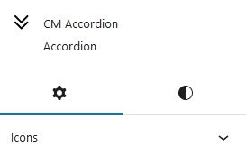
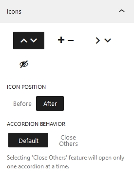
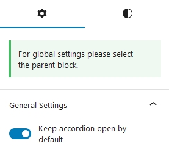
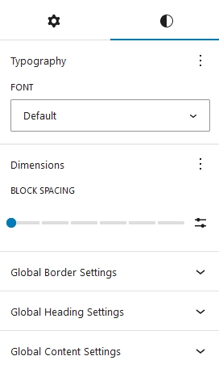
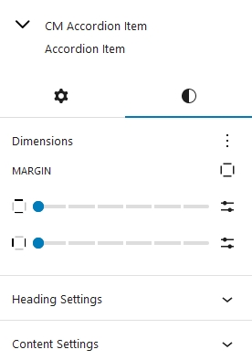

## Introduction
Cm Accordion is a WordPress Blocks that is designed to create accordion sections effortlessly in WordPress. Using our Accordion Block you can create organize data in a compact form. Visitors can expand or collapse its information. This will enhance user experience and make site space organized. Accordion can be used in different sections like, FAQs, Questions Answers and much more.

## Accordion Setting and Styles
Accordion options and customization  is categorized into two i.e Setting and Styles. We have setting and styles options for both acoordion as well as accordion icon.

### Accordion Setting
Accordion Setting can be adjusted from here

#### Icons
The appearance of accordion icons can be chosen from here. Four different accordion icons options are available for now.  Top/Bottom Arrow, Plus/Minus, Right/Bottom Arrow and Hidden.

#### Icons Position
Position of the icons can be customized whether to keep it after the heading or before heading.  By default the position of icons is kept after the heading.

#### Accordion Behaviour
Accordion Behaviour property specifies the condition if the other accordions—aside from the opened one—should be closed. When you set it to Default, all of the accordions open.

### Accordion Icon Setting

Accordion icon setting is for the child element of Accordion. When this option is enabled, the accordion item that is selected will open. This setting can be implemented for each individual accordion item

### Accordion Styles

The global styles for whole accordion heading and accordion can be controlled from here. Inside Global Header Settings and Global Content Setting there is option for both text color and background color. User can customize accordingly.

### Accordion Item Styles

Accordion Items styles is the setting of child element of accordion.

#### Dimensions
Under the Dimensions, options for margin is given. You can control the margin of individuals accordion items.

There is an option available for customizing the text color and background color separately for headings and content, enabling control over these settings for each individual item.