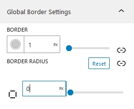
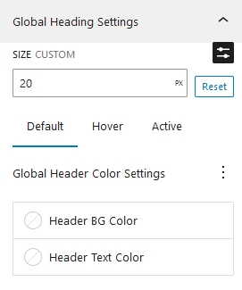
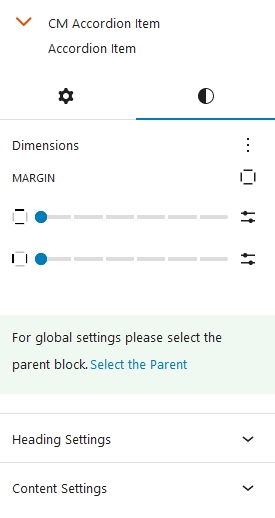
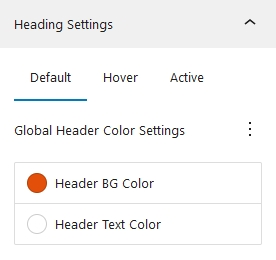
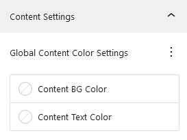

## Introduction
Cm Accordion is a WordPress Blocks that is designed to create accordion sections effortlessly in WordPress. Using our Accordion Block you can create organize data in a compact form. Visitors can expand or collapse its information. This will enhance user experience and make site space organized. Accordion can be used in different sections like, FAQs, Questions Answers and much more.

## Accordion Patterns

To use Our blocks you can directly press <b>+</b> button and search for CM Accordion Block. You can either start building slider from scratch or choose out beautiful prebuild patterns. Currently, there are 5 accordion templates available, which you can use it or also can modify as well.

## Accordion Setting and Styles
Accordion options and customization  is categorized into two i.e Setting and Styles. We have setting and styles options for both acoordion as well as accordion icon.

### Accordion Setting
Accordion Setting can be adjusted from here

#### Icons
The appearance of accordion icons can be chosen from here. Four different accordion icons options are available for now.  Top/Bottom Arrow, Plus/Minus, Right/Bottom Arrow and Hidden.

#### Icons Position
Position of the icons can be customized whether to keep it after the heading or before heading.  By default the position of icons is kept after the heading.

#### Accordion Behaviour
Accordion Behaviour property specifies the condition if the other accordions—aside from the opened one—should be closed. When you set it to Default, all of the accordions open.

### Accordion Icon Setting

Accordion icon setting is for the child element of Accordion. When this option is enabled, the accordion item that is selected will open. This setting can be implemented for each individual accordion item

### Accordion Styles
The global styles for whole accordion heading and accordion can be controlled from here.

#### Typography
Here, you can add the font styles for whole accordion block.

#### Dimensions
Under the Dimensions, you can set the block gap between accordion item.

#### Global Border Settings

Here, we can add border to our accordion blocks globally. Extending the Border: We can also configure the border to a custom side. Similarly, the accordion's border radius can be adjusted on each side individually or on all sides.

#### Global Header Settings

##### Size
Accordion Header text size can be set from here.

##### Global Header Color Settings
You can change the text and background colors under Global Header Color Settings. It is also possible to set these colors for hover, active, and default. The default tab's color value will be used if hover and active color are not selected.

#### Global Content Settings
Here You can change the background color as well as text color of the content.

### Accordion Item Styles
Accordion Items styles is the styles of child element of accordion.

#### Dimensions
Under dimensions, we cn adjust the margin of single accordion items.

#### Accordion Item Header Settings

Accordion items header color settings follow to the same standards as their parent The Default color from accordion is implemented on the accordion item as well. Same goes with the hover as well as active. Similarly, if hover and active colors are not set on accordion item it takes the color value of default colors.

#### Accordion Item Content Settings

Accordion item content colors are inherited from accordion content colors unless you add it manually.
