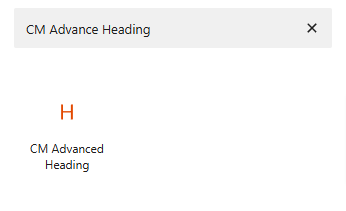
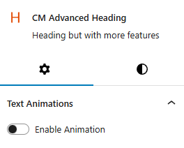
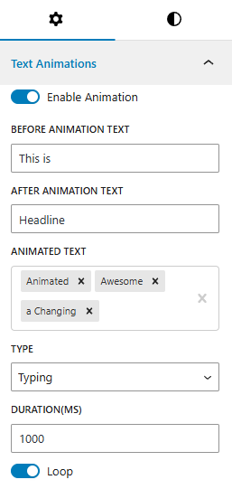
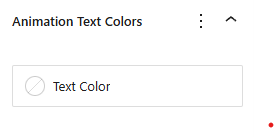
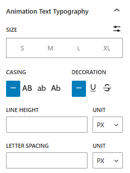
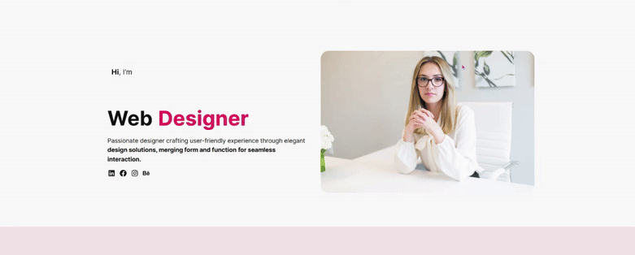

## Introduction
CM Advanced Heading Block allows you to animate your headings with smooth, eye-catching effects, ensuring your website captures visitors’ attention effortlessly.

### Inserting the Advance Heading Block
To use the CM Advance Heading block, click the + button and search for "CM Advance Heading" to add it to your layout.

*Figure 1: How to insert advance heading*

### Configuration & Settings

#### Advance Heading:
Customize the appearance of your advance headings with the following options:

To activate the animation, enable the "Toggle Animation" button; otherwise, the heading will function as a regular heading.

##### Text Animation

- Before Animation Text: The text displayed before the animated text.
- After Animation Text: The text displayed after the animated text.
- Animated Text: The text that includes animation effects. Multiple entries can be added, appearing sequentially in the specified order.
- Type: The animation style applied to the animated text.
- Duration: The time interval for how long the animation lasts.
- Loop: When enabled, the animation restarts from the beginning once all text has been displayed.

##### Animation Text Color

Apply color to the animation text

##### Animation Text Typography

- Size: Defines the font size of the animated text.
- Casing: Specifies text capitalization, such as uppercase or lowercase.
- Decoration: Applies text styling like underline or strikethrough.
- Line Height: Determines the vertical spacing between lines of text.
- Letter Spacing: Controls the space between individual letters.

### Example
