# CM Blog Docs

## Introduction
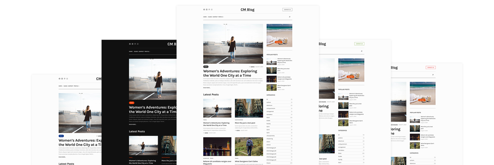

**CM Blog** is a sleek and modern WordPress block theme designed specifically for bloggers who want to showcase their content in a stylish and user-friendly manner. This theme offers a range of customizable blocks and an intuitive drag-and-drop interface, making it simple to create unique and engaging layouts. With its responsive design, CM Blog ensures your site looks great on all devices, from desktops to smartphones. The theme also comes with integrated support for multimedia content, seamless social media integration, and built-in SEO optimization, helping you to maximize your site’s visibility and audience engagement.

## Installation
### Automatic Installation
- [x] Navigate to WordPress <b>Dashboard > Themes</b>.
- [x] Click the Add New Theme and search for <b>"CM Blog"</b>.
- [x]  When the theme appears click <b>Install</b> then <b>Activate</b>.

### Manual Installation

 If automatic installation is not possible, go to [ https://wordpress.org/themes/cm-blog/ ] and you will see the download button. Clicking download button will provide you with a zip file of the theme.

- [x] Go to <b>Appearance > Themes > Add New Theme</b> and click <b>upload Theme</b>. </li>
- [x] Click <b>upload theme</b> and then add the zip file. </li>
- [x] The theme will then be installed, then <b>activate</b> the theme. </li>

## Site Editor

The WordPress Site Editor introduces a new method for creating stunning websites directly within WordPress, eliminating the need for additional page builders. Utilizing blocks, patterns, and a comprehensive set of drag-and-drop design tools, users can effortlessly build pages.

This interface is designed to be user-friendly for individuals of all skill levels, enabling them to craft professional-looking websites with ease. Whether you are creating a blog, a marketing site, or a portfolio, the Site Editor offers the flexibility and customization needed.

To start editing your site with the Site Editor, navigate to Appearance → Editor. From here, you can design and modify templates, set up menus, and personalize your website’s styles, color palette, typography, block styles and more.

To edit templates and sections navigates to the following. Learn more about the Side Editor see official documentation
<a href="https://wordpress.org/documentation/article/site-editor/" target="_blank">here</a>

    Appereance → Editor → Templates 

## Edit Header/Footer
Header and footer can be edited globally in WordPress. To Edit your header/footer follow the following steps

    Appearance → Editor → Patterns → Header/Footer

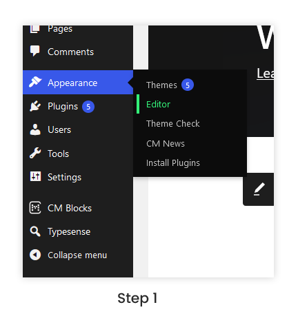

**Step 1**:Go to the WordPress dashboard, select the Editor tab under Appearance.

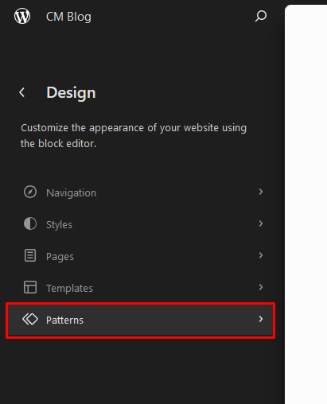

**Step 2**:Navigate to the patterns tab by selecting it from the menu's left-hand side.

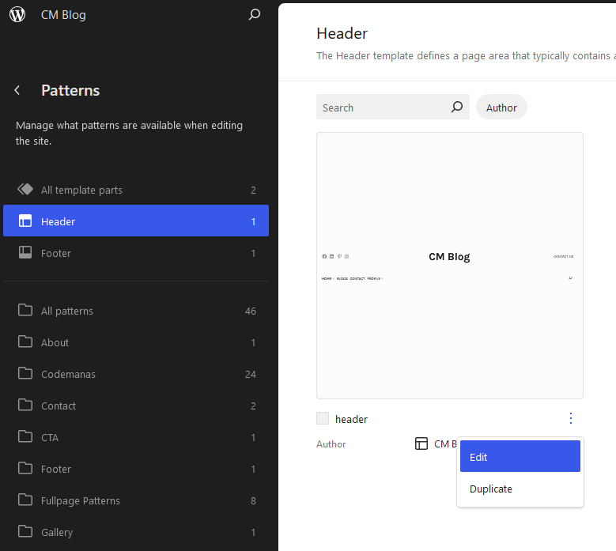

**Step 3**:To modify, click the edit button and choose the heading on the left.

## CM Blog Style Variation and Palette
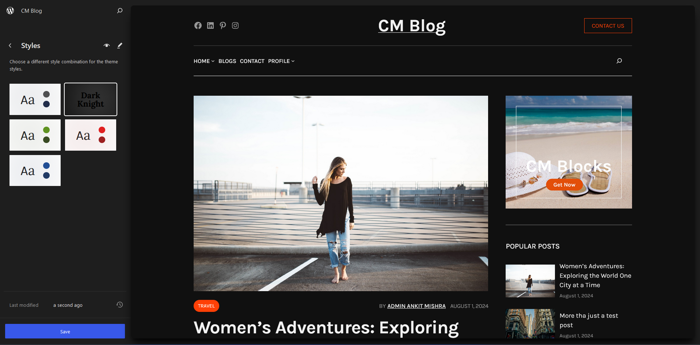

In WordPress, Style Variations are predefined set of design. On block theme it is found under styles/ folder. Clicking each style variation will allow you to see live preview of the theme. Clicking save buttons allow you to save the changes in the theme.

### CM Blog Style Variation

CM Blog theme offers diverse style options to effortlessly transform your WordPress site. Choose from predefined color variations to jumpstart your palette or opt for combinations of colors and typography for a more distinctive look. These variations provide quick and easy ways to enhance the visual appeal and character of your website.

- [x] Color Variation: Default, Dark Knight, Deep Moss, Deep Red, Purple Cage
- [x] Fonts used: Karla, Lore

Here, you’ll see a visual design representation of each style variation in the theme. To change the style variation navigate to:

    Appereance → Editor → Styles

These are the color variation available in our theme

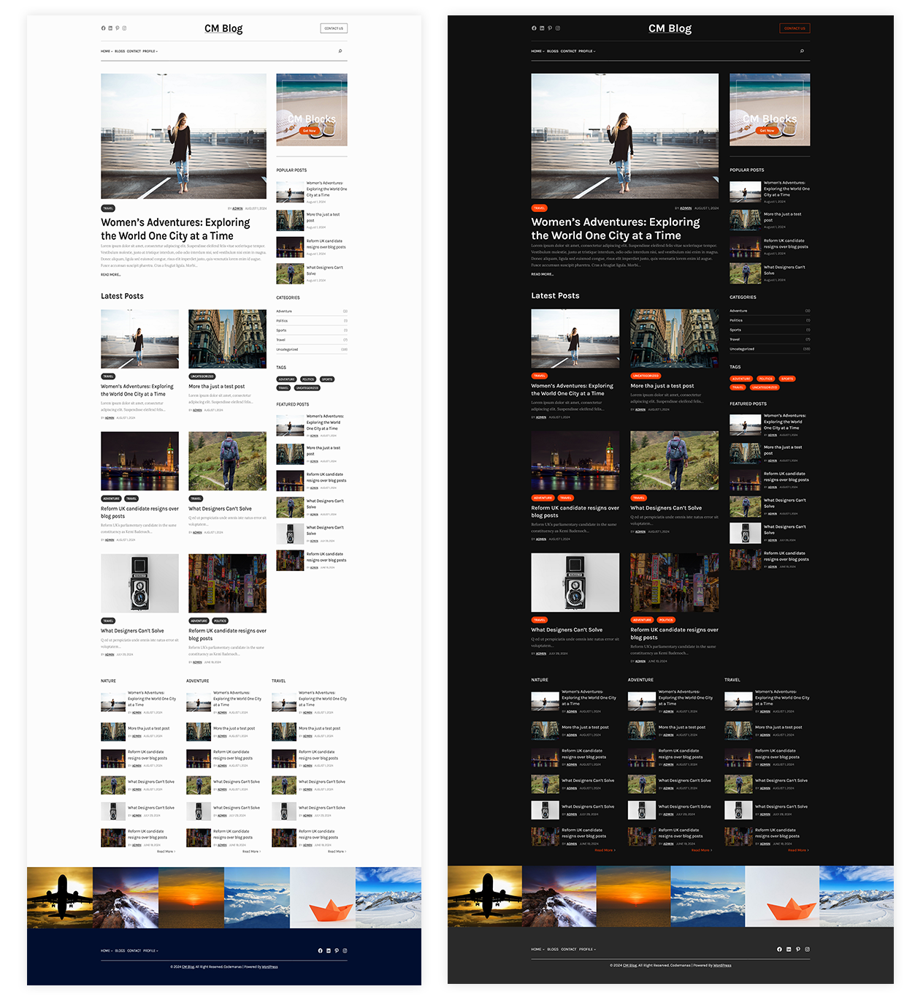

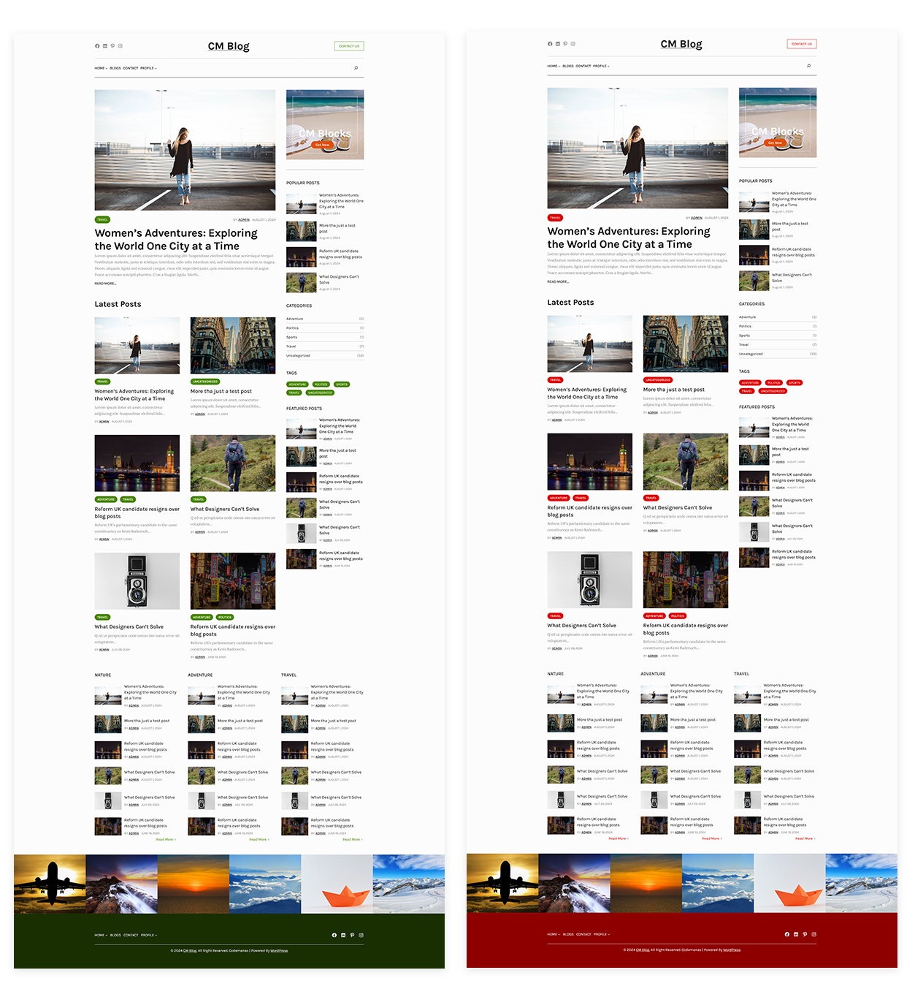

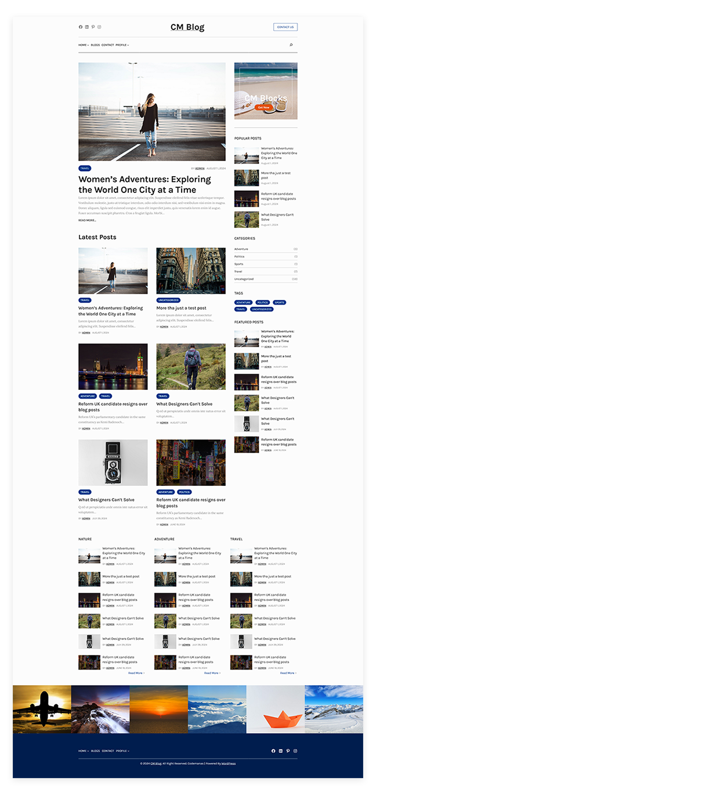

To learn more about the style variation follow official documentation about style variation
<a href="https://developer.wordpress.org/themes/global-settings-and-styles/style-variations/" target="_blank">here</a>

## Global Styles

Global Styles is the central hub within the Site Editor where users have the ability to customize all aspects of their website's appearance. From typography choices to button colors, link styles, and layout presets, Global Styles offers a comprehensive toolkit for refining the visual identity of your site.

This feature streamlines the design process by enabling users to make widespread style adjustments efficiently, rather than editing each element separately. By utilizing Global Styles, website owners can establish a cohesive and polished look that reflects their brand's personality and professionalism with minimal effort.

With Global Styles, maintaining consistency across all web pages becomes effortless. Instead of manually tweaking individual design elements, users can set universal parameters that instantly apply across the entire site. This ensures that fonts, colors, and layout defaults remain uniform, promoting a seamless user experience.

    Appereance → Editor → Styles

<a href="https://developer.wordpress.org/themes/global-settings-and-styles/" target="_blank">Click Here</a> to learn more abut the Global Styles

## Front Page Customization
CM Blog allows users to customize the front page. Take the following actions to customize the home page:

- After entering the **WordPress Dashboard**, select the **Appearance** tab and then select the **Editor**.
- Next, select the **Templates** tab, where you can view the many templates that are compatible with our theme.
- To make changes, click the three vertical dots in the Frontpage template's lower right corner.

We have seven sections in Frontpage, which include the Header and Footer.

### How to Edit Front Page?

To Edit Frontpage follow the following steps:

**Step 1**: Go to the WordPress dashboard, select the Editor tab under Appearance.

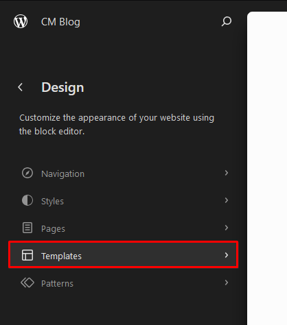

**Step 2**: Navigate to the template tab by selecting it from the menu's left-hand side.

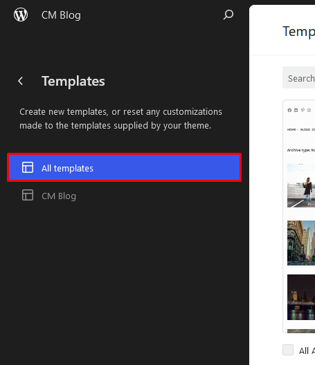

**Step 3**: To make changes to the frontpage template, click the edit button that shows up when you click the three dots in the lower right corner of the template.

### How to Edit Front Page Section?

Suppose you want to list blog of another category in the homepage's hero section. To achieve it follow the below steps:

    Appereance → Editor → Templates → Edit Frontpage Template

- [x] First of all select the query loop block.
- [x]  Next, the block panel shows up on the dashboard's right side.
- [x]  And then add desired category by clicking the plus symbol. The visualization is shown in the image below:

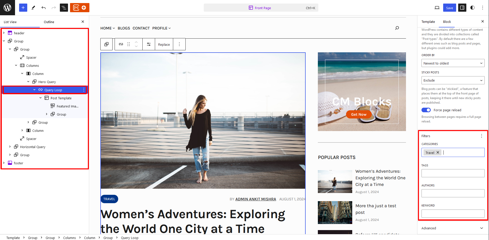

## How to make sticky Header?

CM Blog theme allows you to make header sticky globally. In order to use this feature you have to download the latest version of <a href="https://wordpress.org/plugins/cm-blocks/" target="_blank">CM Blocks</a> plugin.

First, open the **Site Editor** by going to the WordPress admin, **Appearance** > **Editor**. Choose the template you want to edit, and click on the edit button to edit the template. Then, follow the steps given below:

1. First select the header template from the List view.
2. Select and drag the header template part inside the new group. Make the header full-width.
3. Select the group block and open the position panel. Select the “Sticky” option.

        Remember to update every template where you want to make sticky header.

## FullPage Patterns
We provide full-page patterns in CM Blog Theme for pages such as contact, profile, Home v2, Home v3 and so on. You may insert the full-page patterns the same way you put other patterns in order to use them.

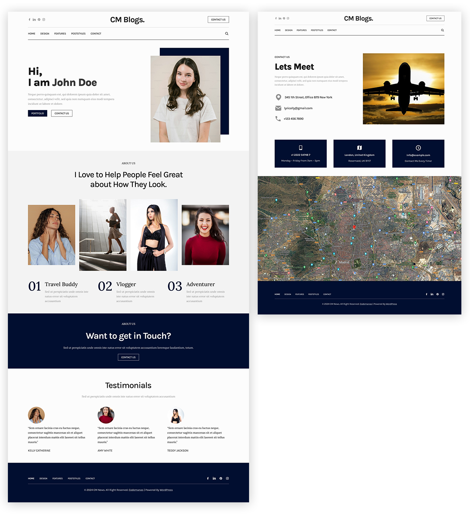

Follow the steps performed in the video Below.

## How to make Patterns Fullwidth?
Some users want the patterns to be full width in **CM Blog**. So if you want to make any patterns fullwidth just disable **Inner blocks use content width** in the group which is directly under the outer group. The demonstration is also shown in the video below

