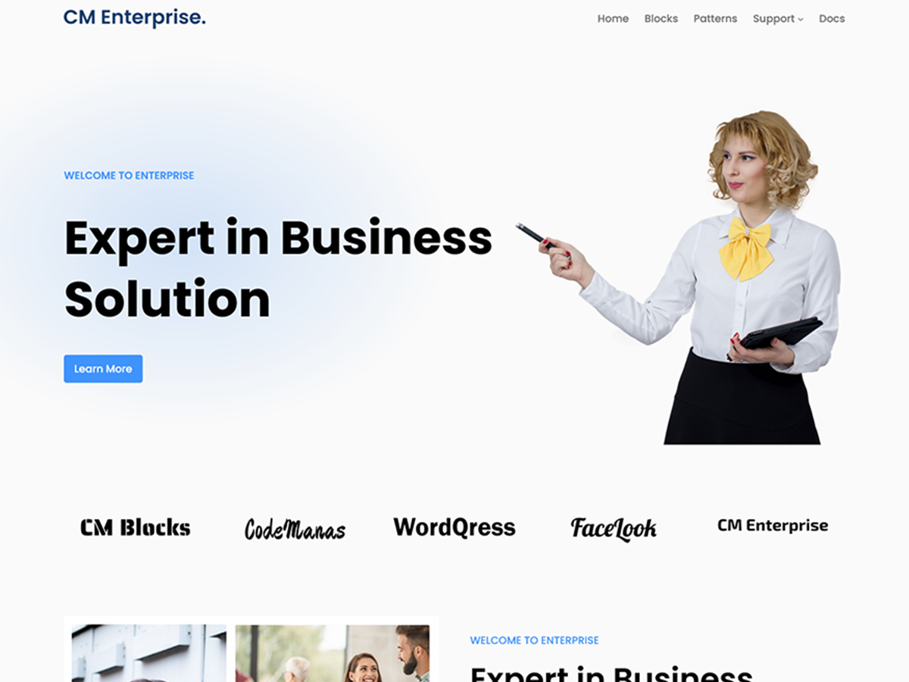
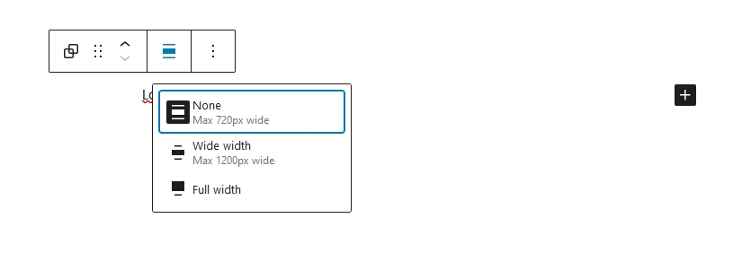

# CM Enterprise Docs

## Introduction

**CM Themes** empowers users to craft dynamic, engaging websites effortlessly. Experience the future of WordPress design with our cutting-edge solution. Unlock boundless possibilities and redefine your digital landscape today!

## Design Principle
Att of our theme follows or will follow 60 - 30 - 10 design rule for color.

* 60% of the dominant color is used on the website.
* 30% of the secondary color is used. It includes various components like header, footer, CTA, illustrations etc.
* 10% of the remaining color is accent  color which includes buttons, links, icons etc.

Similarly, choosing the appropriate container width and color during website design is crucial to determining how the user interacts with the site. three widths: full, content, and wide. Both readability and aesthetics are impacted by container width; sites with a lot of text should use smaller containers (600–800 pixels), while those with images should use broader ones (1140–1200 pixels). This value is not just random. It's often chosen because of its easy divisibility which helps with grid systems. In CM theme, we have set content width to 720px and container width to 1200px.

### Layout

    Full Width = 100%     Wide width = 1200px     Content Width = 720px
   
We offer three layouts in our theme. three widths: full, content, and wide. The width of the screen is 100% when it is at full width. Wide width goes to 1200px which is standard global container size and works with grid systems. Sorting the items within the width is helpful. 2, 3, 4, and 6 all items inside container receive equal width making it more pixel perfect for equal width distribution. Likewise, the content width is set to 720 pixels, which is appropriate for text and content readability.

### Fonts
Currently, there are only limited fonts which comes locally along with the theme. However, after WordPress 6.5 you can add google fonts directly from the site editor. Here's how you can add it:

    Go to : Appearance > Editor > Edit any Templates > Styles > Typography > Fonts

### Page/Posts Templates
We offer four different templates in our theme for both post and page. 

**Default:** Default Template for page doesn't have page title and the layout type is constraint. Likewise, default template for posts comes with featured image, title, date, published date, admin, categories and commesnts.

**No Title:** No Title template for both posts and page have no title and the layout type is constrained. 

**Splash/Blank Canvas:** Splash templates is completely blank. It doesn't have header and footer but have content only.The Width of this template is always 100%. If you want to change the width to content size or wide to the content you can adjust by wrapping content with group. You have the options to play with your own creativity playing with this template.

**Single With sidebar:** This templates comes with sidebar on the right side and content on left side. This template is available for both posts and pages.

### Style Variation
We provide 5 different style variation on free theme. Style variation comes with different fonts as well which we provided from the theme. Here's how you can change style variation:

    Go to : Appearance  >  Editor  >  Styles(on left sidebar)

### Patterns
All the CM theme will be based on patterns. i.e. theme have full page patterns variation instead of template. eg: full page home template, full page about template, full page contact template etc. 