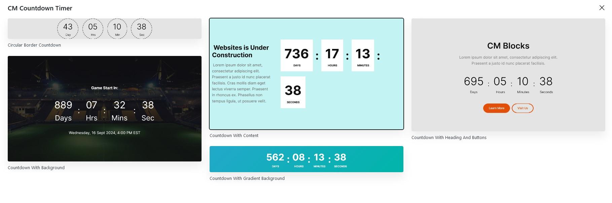
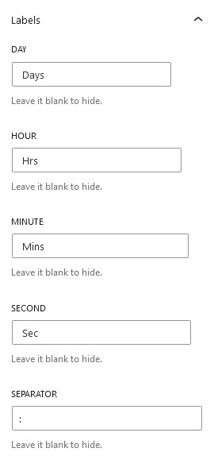
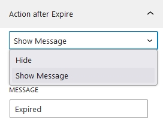
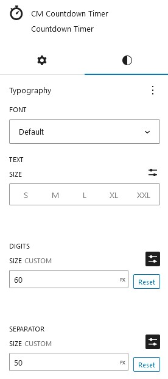
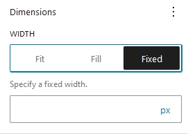
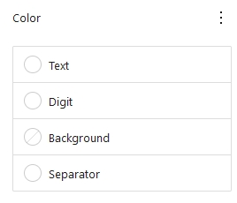
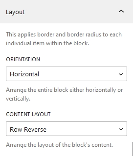
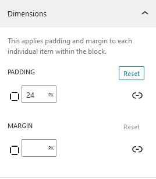
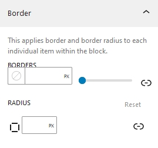

## Introduction
CM Countdown is a WordPress Blocks plugin crafted for creation of stunning counters within the WordPress content editor. Countdown timers are effective for generating excitement, anticipation, and urgency for upcoming events, product launches, promotions, or any other time-sensitive activities. The block offers a variety of options to tailor it to your preferences.

## Countdown Patterns

To use our blocks, use the <b>+</b> button and search for "CM Countdown" to access the block. Jumpstart your design with a choice of over five  pre-built countdown templates, or customize your Countdown entirely from scratch.

## Countdown Setting and Styles

Countdown options and customization  is categorized into Setting and Styles.

### Countdown Setting

#### Expiry time
Users can select the date and time of their events and initiate a countdown until the chosen date. Clicking on the link triggers a popup calendar to appear on the right side, enabling users to select the desired date and time for their events.

#### Labels

The label text can be added for days, Hours, Minutes, Seconds and Separator as well.

#### Action after Expiry

This options allow you to display your own custom message after the countdown time expires. The options can be hidden or shown from the dropdown.

### Countdown Style

#### Typography
Countdown typography offers a range of fonts, text sizes, digit sizes, separator sizes, and more.

#### Dimensions

There are three options available for the countdown's width. The first is to fit the countdown within the width of the screen; the second is to fill; a custom fixed width of the countdown can also be selected.

#### Color

The color options include the text color of titles, digit and separator. As well as background color also can be selected from the options

#### Layout

##### Orientation
The countdown has two orientation options: vertical and horizontal. 

##### Content Layout
There are four options for content layout: row, column, row-reverse, and column-reverse.

#### Countdown Dimensions

The Countdown dimensions includes padding, margin, and separator margin. Each of these can be adjusted individually for precise customization.

#### Border

In this option, the border of countdown is applied. Expanding the border options allows you to give border individually to every side. Similarly, border radius also can be added from the bottom options.