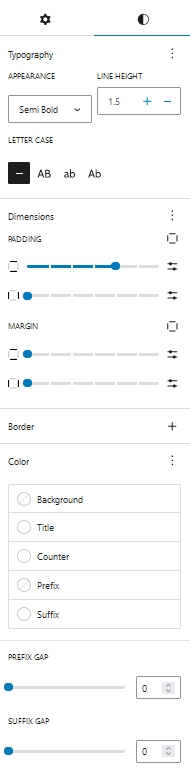
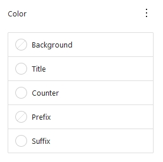
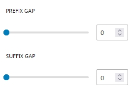

## Introduction
CM Counter is a WordPress Blocks plugin crafted for creation of counters within the WordPress content editor. Counters can display numeric data, milestones, or statistics without the need for extensive coding. The plugin provides various customization options such as Prefix, Suffix, Counter Durations, and diverse styles, empowering users to use the counters to their preferences.

## Counter Patterns

To use CM Counter blocks, use the  <b>+</b> button and search for "CM Counter" to access the block. Jumpstart your design with a choice of over five unique  pre-built counter templates, or customize your counter entirely from scratch.

## Counter Setting and Styles
Counter options and customization  is categorized into Setting and Styles.

### Counter Setting

#### Title
Toggle On the button to enable title in counter. Here you can add the title of a counter.

#### Start
Give the starting value of a counter.

#### End
Here you add the ending value of counter.

#### Duration
Add the time duration for counter  to run from start value to end value (1000ms = 1 seconds).

#### Prefix
It is the text which can be displayed before the counter value.

#### Suffix
It is the text which can be displayed after the counter value.

#### Thousand Separator

Comma (,) and (.) Dots two options are provided as the thousand seperator.

### Counter Styles

#### Typography
These are the same default options that WordPress provides. You can alter every text option on the counter, including appearance, font family, line height, text decoration and letter spacing.

#### Dimensions
Counter Dimensions have options to control padding and margin of the counter.

#### Border
Border radius and Border can be added in counter from here. 

#### Color

Colors for the counter background, title, counter text, suffix, and prefix can all be manually changed.

#### Suffix Gap and Prefix Gap

This options adds gap between prefix - counter and counter - suffix