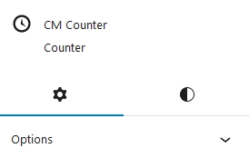
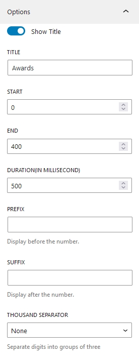

## Introduction
Cm Counter is a WordPress Blocks that is designed to make the creation of beautiful Counters easily without writing a bunch of code inside WordPress content editor. Using CM Counter you can easily showcase any numeric data, milestones or any statistics. This WP Blocks offers various customization options like Prefix, Suffix, Counter Durations and other styles offering user to customize as per their wish.

## Counter Patterns

To use CM Counter blocks you can directly press <b>+</b> button and search for CM Slider block. You can either start building slider from scratch or choose out beautiful prebuild patterns. Currently, there are 5 beautiful patterns available, which you can use it or also can modify as well.

## Counter Setting and Styles
Counter options and customization  is categorized into Setting and Styles.

### Counter Setting

#### Title
Toggle On the button to enable title in counter. Here you can add the title of a counter.

#### Start
Give the starting value of a counter.

#### End
Here you add the ending value of counter.

#### Duration
Add the time duration for counter  to run from start value to end value (1000ms = 1 seconds).

#### Prefix
It is the text which can be displayed before the counter value.

#### Suffix
It is the text which can be displayed after the counter value.

#### Thousand Separator

Comma (,) and (.) Dots two options are provided as the thousand seperator.

### Counter Styles
#### Typography
These are the same default options that WordPress provides. You can alter every text option on the counter, including appearance, font family, line height, text decoration and letter spacing.

#### Dimensions
Counter Dimensions have options to control padding and margin of the counter.

#### Border
Border radius and Border can be added in counter from here. 

#### Color
Colors for the counter background, title, counter text, suffix, and prefix can all be manually changed.

#### Suffix Gap and Prefix Gap
This options adds gap between prefix - counter and counter - suffix