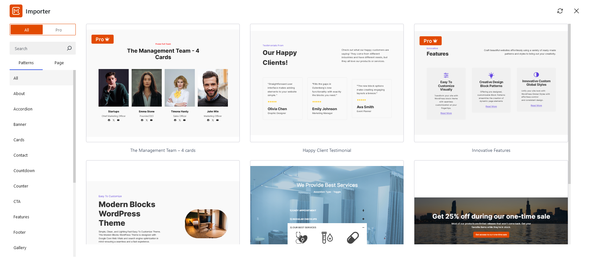
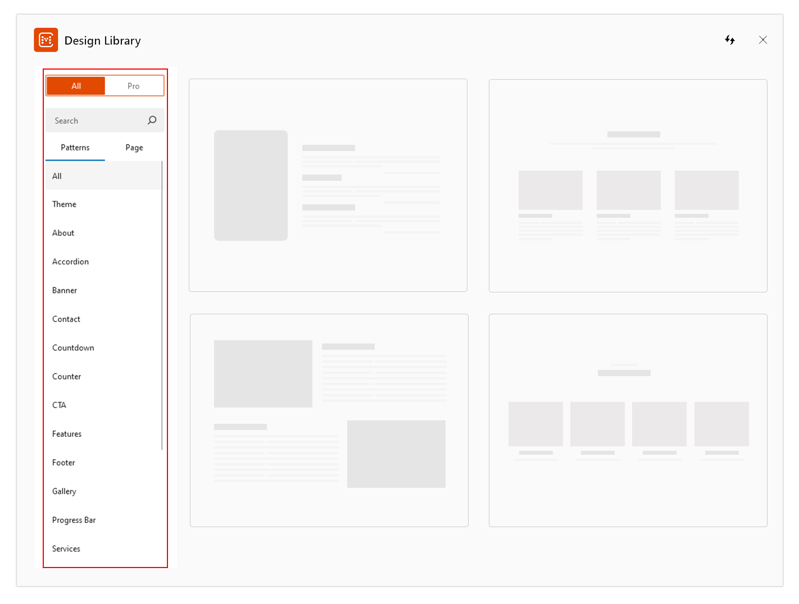

Here are the steps to add our built-in patterns to your website:

* Install and activate **CM Blocks**
* Open your desired page or post
* Click on the **Design Library** button at the top of the editor
* A popup of design library is displayed.

* On the left side of the you will see a sidebar with filters like All/Pro, Search Bar, Patterns/Pages, and categories.

* If you click **Patterns**, you will see patterns such as **Banner**, **Services**, **Testimonials** and so on. You can select a category to filter patterns from a particular group.

* If you click on **Page**, you will see full-page patterns. You can select these pre-built patterns for the **Home**, **Portfolio**, **Contact**, and more.

* Selecting **All** will display both free and pro patterns, while selecting pro will exclusively show pro patterns.

* You also have the option to search for patterns using specific keywords using the search bar.

* Simply click on the pattern, you want to insert into your page or post, and then you can add, remove, or edit the content as needed 
* Lastly, click on Publish to save changes,

