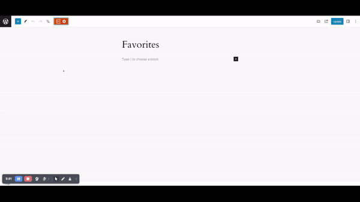
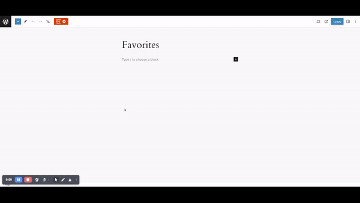

Here are the steps to Add, Remove or Display the favorites patterns:

* Install and activate **CM Blocks**
* Open your desired page or post
* Click on the **Design Library** button at the top of the editor
* A popup of design library is displayed

#### To Display
* Click on **Favorites** button displayed in the top right corner in the **Design Library**
* Select the pattern, page, or kits from the tab to view your favorite patterns

#### To Add
* Hover on the patterns 
* Favorites icon will be displayed
* Click on the favorite icon to add to favorites

#### To Remove
* Hover on the patterns
* Favorites icon will be displayed
* Again click on the favorite icon to remove from favorites

    ***OR***

* Click on **Favorites** button displayed in the top right corner in the **Design Library**
* Hover on the patterns
* Favorites icon will be displayed
* Again click on the favorite icon to remove from favorites

