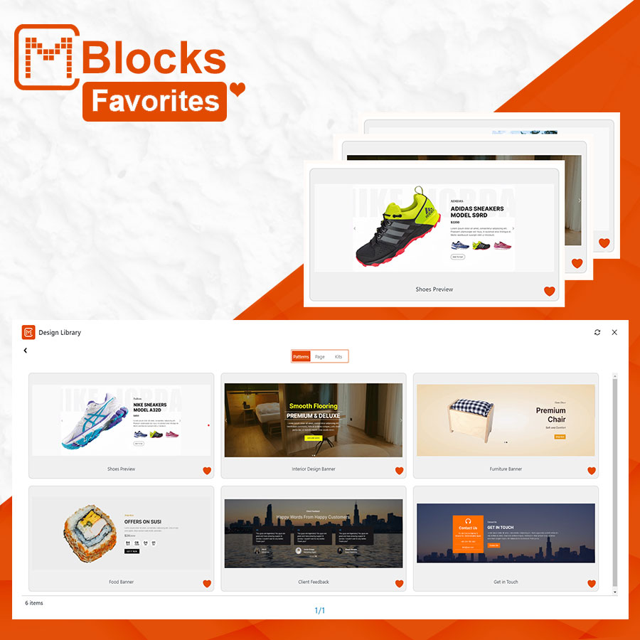

# Favorites

Favorites is a feature in CM Blocks that allows users to mark and save their preferred designs, patterns, or kits. It helps users quickly access their favorite items, making their workflow more efficient and boosting productivity by minimizing the time spent searching for specific patterns or kits.
