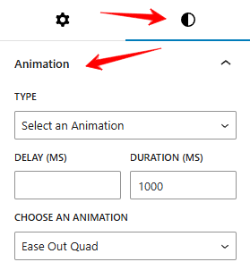
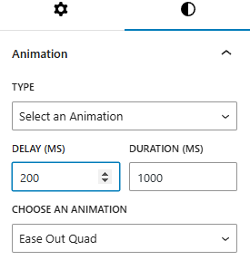

Introducing a seamless Animations feature that lets you effortlessly enhance your content with captivating motion effects.

## Why use Animations?
Animations boost user engagement by adding a dynamic and interactive touch to your website. Whether you aim to highlight key sections, enhance storytelling, or simply create a visually appealing experience, animations make it easy to achieve stunning effects with minimal effort.

### Let's Get Started
To use the CM Animation feature, simply install CM Blocks, select a block, go to the Styles tab, and open the Animation panel.

### Customize Your Animation
Adjust the duration, delay, and other options to fine-tune the effect.

- Type: Choose from a range of predefined animations to apply to the block.
- Delay: Sets the time before the animation starts.
- Duration: Determines how long the animation lasts from start to finish.
- Animation Timing Function: Controls the speed variation of the animation, allowing for smooth acceleration at the start and deceleration at the end.

