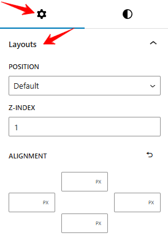
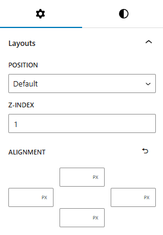

The new Layout Feature allows you to easily control the positioning of any block by selecting from various positioning options, including relative, absolute, fixed, and more. This gives you greater flexibility in arranging elements on your page.

## How to use Layout

To use the CM Layout feature, simply install CM Blocks, select a block, go to the Setting tab, and open the Layout panel.

### Control Positioning
Fine-tune the block by adjusting its position, z-index, and alignment for precise placement and layering.

- Position: Determines the placement of the block within its container.
- Z-Index: Controls the stacking order of the block, determining which elements appear on top when they overlap.
- Alignments: Adjusts the block's alignment, such as left, center, or right, within its parent container.

