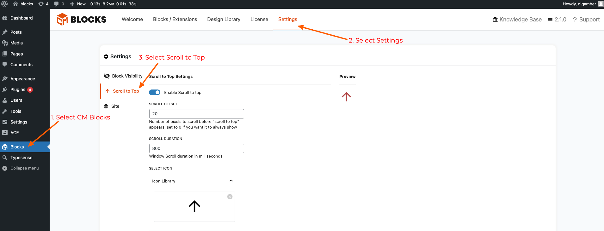
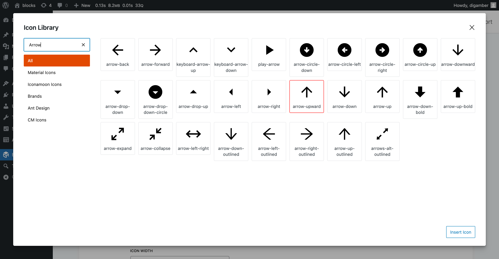

#Scroll to Top

This feature lets users add a “Scroll to Top” button anywhere on their WordPress site, giving visitors an easy way to navigate back to the top of a page with just one click.

To enable this feature go to your WordPress Admin / Backend

```     CM Blocks > Settings > Scroll to Top      ```



Configuring:

###Enable Scroll to Top
Toggle to enable scroll to top - this will add the scroll to top to all pages of the site.

###Scroll Offset
Choose how many pixels are scrolled before the "Scroll to Top" button shows up.
Add 0 to always show it.

###Scroll Duration
Determines how fast or slow the scroll happens.

###Select Icon
Use the CM Blocks icon Library to find the best icon for your site.


###Icon Width & Icon Height
Configure the Width / Height of the Scroll to Top Button

###Icon Color
Select the color that best matches your site.

###Select Location
Select the placement of the Scroll to Top Button in context to the page.