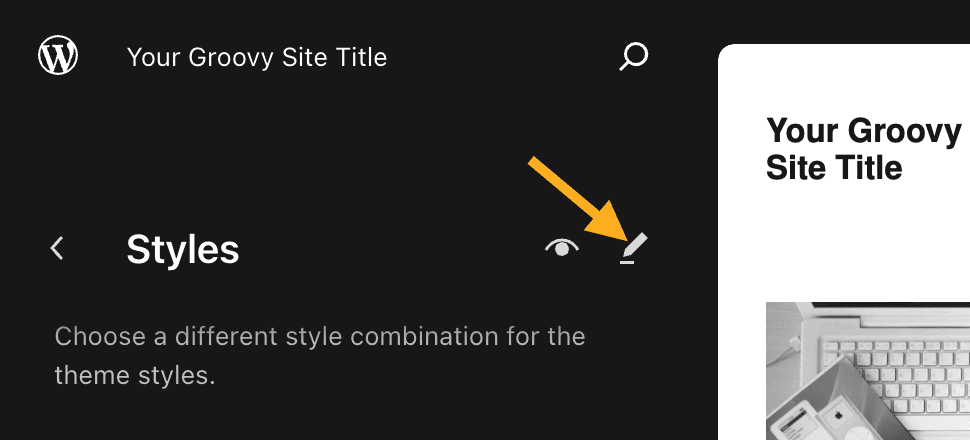
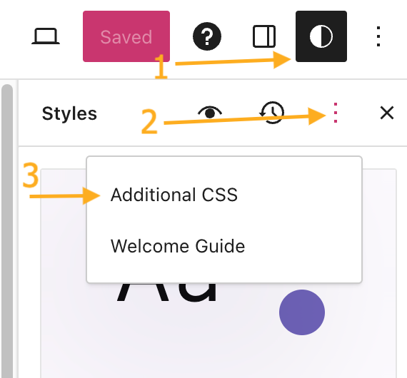
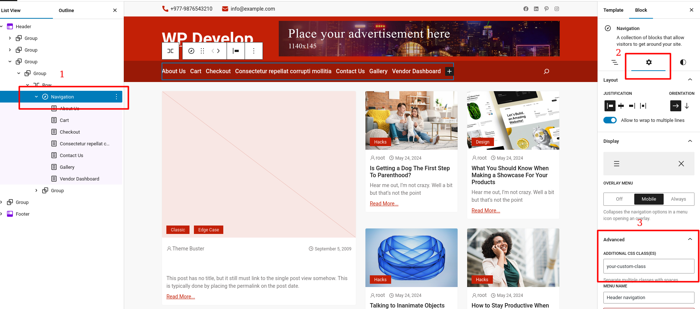

## How to add Additional CSS

1. Visit your site’s dashboard. 
2. Navigate to Appearance → Editor. 
3. Click Styles in the Design menu on the left.
    - If your theme includes Style Variations, you must then click the pencil icon to open the Styles options:
         
4. Click the three dots to the right of the “Styles” heading and choose “Additional CSS“:

5. Type or paste your CSS into the text box provided. 
6. Click the “Save” button at the top right of the screen to save the CSS to your site.

## How to add hover state for navigation block

By default, the new Site Editor doesn't offer an option to set the hover state for navigation items. Therefore, custom CSS is required. Follow the guide on [How to add Additional CSS](#how-to-add-additional-css).

To modify the hover state of every navigation item on your site, use the following CSS:

`.wp-block-navigation-item:hover {
    color: #0000FF;
}`

If you want to apply CSS specifically to the header navigation, add a custom class to the navigation block as shown in the screenshot below and adjust your CSS accordingly:

Here's the CSS to target the header navigation:

`.your-custom-class .wp-block-navigation-item:hover {
    color: #0000FF;
}`