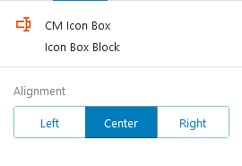

## Introduction
The Icon Box WordPress plugin that creates attractive boxes on your website. These boxes can include custom icons, headings, paragraphs, and buttons. You can choose your own icons from the CM Icon feature, while the headings, paragraphs, and buttons are built-in features of WordPress.

## Use Icon Box
To use Our blocks, use the <b>+</b> button and search for "CM Icon Box" to access the block.This will insert a default box consisting of icon, heading, paragraph and button. 

 The box can be aligned to the left, center, or right of the page. Additionally, you can customize the icon, heading, paragraph, and button within the box to match your desired style.
