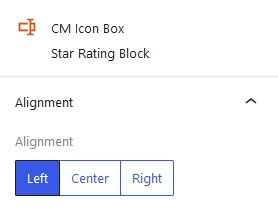

## Introduction
**CM Icon Box** is a versatile WordPress block designed to showcase content alongside visually appealing icons. It allows users to create eye-catching sections with customizable icons, titles, and descriptions, perfect for highlighting features, services, or key information. With extensive design and layout options, Icon Box provides a flexible way to enhance the visual appeal and clarity of any page or post.

## CM Icon Box 

There is only one choice provided for the icon box that helps in setting its alignment: left, center, and right.