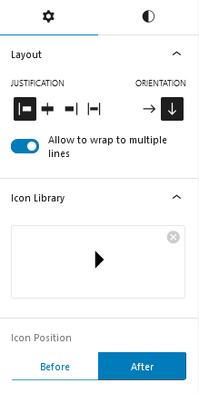
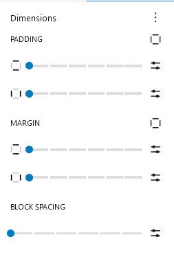
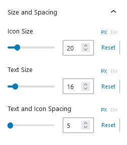
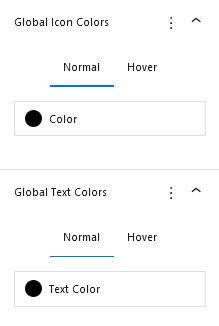

## Introduction
The CM Icon List is a WordPress Block that creates lists with icons next to each item. The icons can be customized in terms of size, color, and style to fit the website’s design. This feature enhances the content’s visual appeal and makes it easier to read by incorporating icons into the list. 

## Use Icon List
To use Our blocks, use the <b>+</b> button and search for "CM Icon List" to access the block.This will insert a default icon list. You can then customize the icon by selecting from the icon library according to your preferences.

### Icon List Setting

#### Layout
The layout options let you align content left, center, right, or justify it. You can arrange items horizontally or vertically, and enable wrapping to allow content to flow onto multiple lines.

#### Icon Library
An icon library is a collection of icons organized into categories, allowing users to browse, search, and select icons for use in websites, applications.

#### Icon Position 
It adjusts the icon size before and after.

### Icon List Style

#### Dimensions
The Dimensions feature allows you to adjust padding inside, margin outside, and block spacing between elements. 

#### Size and Spacing
The Size and Spacing feature allow you to adjust the icon size, text size, and the spacing between text and icons. 

#### Global Icon Colors
The global icon feature allows you to change the icon color icon globally.

#### Global Text Colors
The global text feature allows you to change the text color icon globally.

