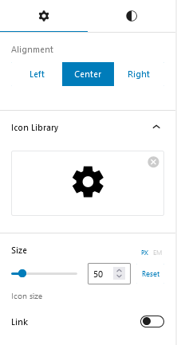
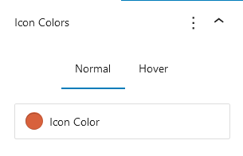

## Introduction
CM Icon is a WordPress Blocks plugin crafted to customize icons, including the ability to adjust colors, resize icons, and choose from a wide range of icon libraries, such as Material Icons and social media icons. This functionality enhances the visual appeal of websites, allowing for seamless integration of icons that align with the overall design. 

## Use Icon 

To use Our blocks, use the <b>+</b> button and search for "CM Icon" to access the block.This will insert a default icon into your content. You can then customize the icon by selecting from the icon library according to your preferences.

### Icon Settings

#### Alignment
The alignment feature lets users choose how content is positioned on a page. It provides three options: left, center and right.

#### Icon Library
An icon library is a collection of icons organized into categories, allowing users to browse, search, and select icons for use in websites, applications.

#### Icon Size
It adjusts the icon size according to your preference.

#### Link
Add links to the selected icon, with options to open the link in a new tab and mark it as nofollow

### Icon Style

#### Icon Colors
Icon colors can be customized and adjusted for hover effects.

