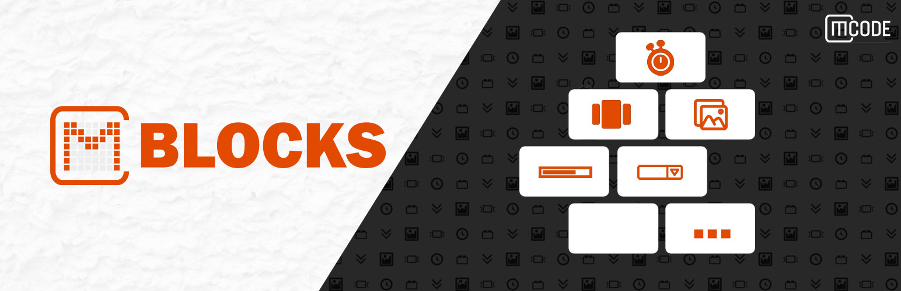

# CM Block

## Introduction

**CM Blocks** plugin is a collection of page building blocks for WordPress block editor. The growing collection of page building components has everything you need to create a professional website. And there are still a ton of blocks to come.

You can also combine multiple blocks, customize it and make stunning posts and pages.
<ul>
    <li>5+ Blocks for initial release.</li>
    <li>5+ patterns design  for each blocks.</li>
    <li>Pro Features in Free version.</li>
    <li>Customizable.</li>
    <li>Setting and Styles tab for each blocks.</li>
</ul>

    We don't currently have a live demo that uses every block in our library.
    However, we are confident that it is easy to use because we have lovely 
    built-in templates that simplify your work.