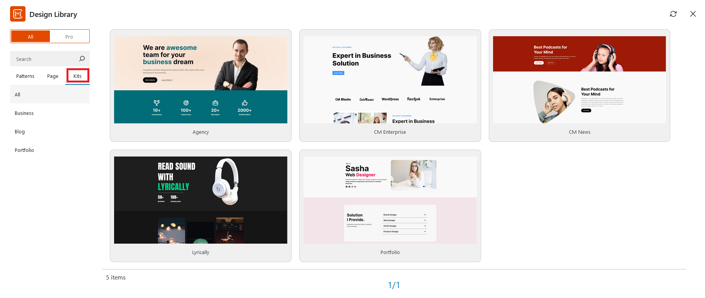
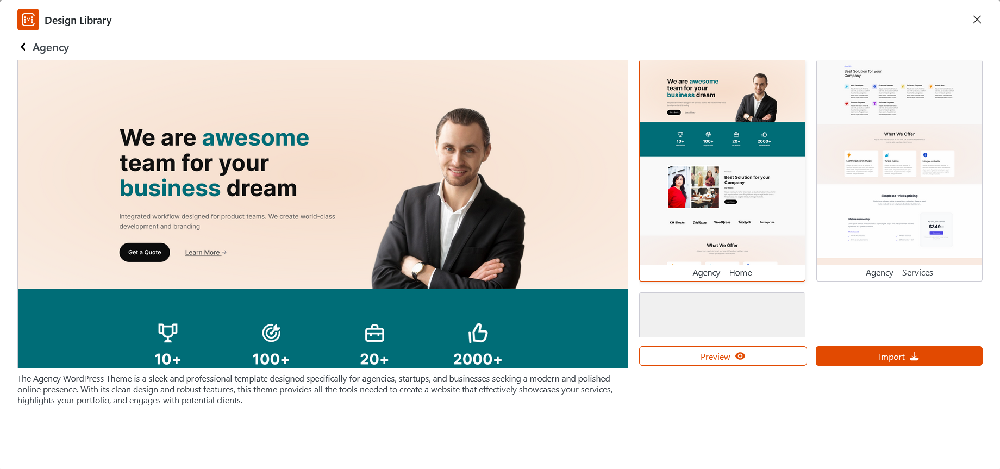

Here are the steps to add our built-in Kits to your website:

* Install and activate **CM Blocks**
* Open your desired page or post
* Click on the **Design Library** button at the top of the editor
* A popup of design library is displayed.
* Click on **Kits** to display the Catgeory section.

* Clicking on **Kits** displays a collection of multiple pages, such as **Lyrically**, **CM Enterprise**, **CM News** and so on. You can select any categoery as per requirement.

* You also have the option to search for Kits using specific keywords using the search bar.

* After selecting a category, a section of templates will be displayed. Select any template to preview it.

* Click on Preview to see the demo of the template.

* Simply click the import button to insert the template into your page or post. You can then add, remove, or edit content as needed.

* Finally, click Publish to save your changes.

