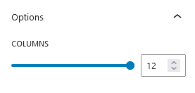

## Introduction
CM Masonry Gallery is a WordPress Blocks plugin designed to make the grid based gallery in WordPress content editor. Unlike traditional gallery, Masonry Gallery utilizes dynamic algorithm to automatically adjust image on the basis of their dimensions. The gallery make each image fits tightly together. Masonry Gallery also provides dynamic customizations options like lightbox, captions etc.

## Use Masonry Gallery

To use Our blocks, use the <b>+</b> button and search for "CM Masonry Gallery" to access the block. At first, select your favorite images to create gallery and customize them accordingly.

## Masonry Gallery Setting

### Options

This column specifies the total number of images to be displayed in a row. The maximum number of columns is 12, meaning that up to 12 items can fit in one row.

### Caption

Turning on captions makes it easier to add text overlays to each image. You can also choose where the captions will appear: at the Top, Bottom, or Center.

### Lightbox

Turning this feature on makes each image have a popup effect. A popup window with a large image will appear when the user clicks on each of the gallery images.