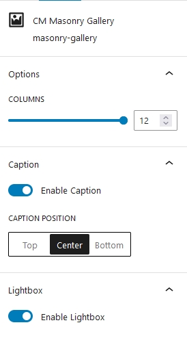
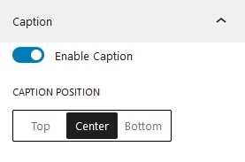
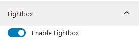

## Introduction
Cm Masonry Gallery is a WordPress Blocks that is designed to make the grid based gallery inside WordPress content editor. Unlike traditional gallery, Masonry Gallery utilize dynamic algorithm to automatically adjust image on the basis of their dimensions. This Gallery  make each image fits tightly together. Masonry Gallery also provides dynamic customizations options like lightbox, captions etc.

## Use Masonry Gallery

To use Our blocks you can directly press <b>+</b> button and search for CM Masonry Gallery block. At first, you have to choose multiple images to create a gallery and go on customizing it.

## Masonry Gallery Setting

### Options
This columns specifies total number of image to be displayed in row. The maximum number of columns is 12. that means 12 items can be fitted on 1 row

### Caption

Turning on captions makes it easier to add text overlays to each individual image. This is also where you can specify where the caption will appear i.e Top, Bottom or Center.

### Lightbox

Turning this feature on makes each image have a popup effect. A popup window with a large image will appear when the user clicks on each of the gallery images.