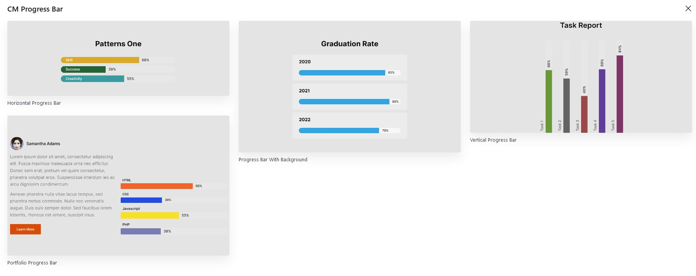

## Introduction
CM Progress Bar is a WordPress Blocks plugin that helps to create attractive slider bars on your website without having to write lots of code. CM Progress Bar can easily showcase progress percentages, milestones, skill levels, and more. It offers customization options like choosing colors, layouts, and orientations to match desired way.

## Progress Bar Patterns

To use our blocks, use the <b>+</b> button and search for "CM Progress Bar" to access the block. Jumpstart your design with a choice of pre-built progress bar templates, or customize your bar entirely from scratch.

## Progress Bar Setting and Styles
Progress Bar options and customization  is categorized into Setting and Styles.

### Progress Bar Setting

#### Title
This field allows to set the title of progress bar.

#### Percentage
This field allows to set the value of progress bar.

### Progress Bar Styles

#### Color
Progress Bar Title color, Background color, percentage text color and overall progress bar background color can be chosen from here. 

#### Layout

The Progress bar layout either can be set horizontally or vertically.
#### Title and Percentage

##### Title Style

Title styles can be set as default, outside-top, outside-bottom, or hidden.

##### Percentage Style

Percentage styles can be set as default, outside top, outside bottom, append or hidden.

#### Dimensions and Motions

##### Duration
The time duration of the Progress Bar can be adjusted from the duration option.

##### Height
Height/Thickness of Progress Bar can be adjusted from the height option. For the vertical layout this option works as width.

##### Width
The width of the progress bar can be adjusted to full width and customized accordingly.

##### Border Radius
Border radius option enables to set the border radius of Progress bar.