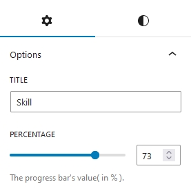
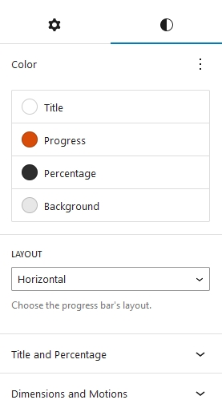
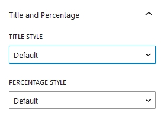
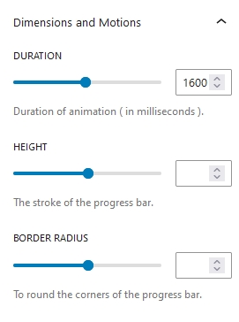

## Introduction
CM Progress Bar is a WordPress Blocks designed to make beautiful slider bar without writing long lines of code on WordPress editor. Using CM Progress Bar you can easily showcase any progress percentage, milestones, showing skills levels and do much more. You also can get customization options like color, layout, orientation etc.

## Use Progress Bar

To use Our blocks you can directly press <b>+</b> button and search for CM Progress Bar block. When you use our Progress bar, default design appears at first. Then you can customize with our own design preferences.

## Progress Bar Setting and Styles
Progress Bar options and customization  is categorized into Setting and Styles.

### Progress Bar Setting

#### Title
This field allows to set the title of progress bar.

#### Percentage
Here you can set the value of progress bar.

### Progress Bar Styles

#### Color
Progress Bar Title color, Background color, percentage text color and overall progress bar background color can be chosen from here. 

#### Layout

The Progress bar layout either can be set horizontally or vertically.
#### Title and Percentage

Title and Percentage style can be customized from here

Here, the position of both title and percentage can be adjusted from here.

#### Dimensions and Motions

The time duration of the Progress Bar can be adjusted from the duration option.

Height/Thickness of Progress Bar can be adjusted from the height option. For the vertical layout this option works as width.

The width of the progress bar can be adjusted to full width and customized accordingly.

Border radius option enables to set the border radius of Progress bar.