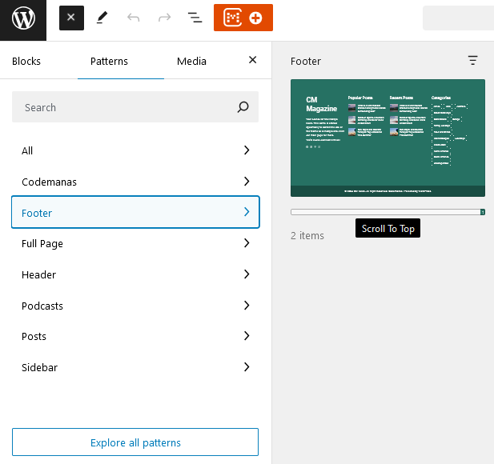

## Introduction
Scroll to Top is a feature that adds an upward-facing arrow to the footer of your website. When clicked, it smoothly scrolls the page back to the very top, saving users the time and effort of manually scrolling. This feature enhances user experience by providing a quick and easy way to navigate back to the beginning of the page.

## Use Icon Box
To activate the Scroll to Top feature, follow these simple steps:
<ul>
<li>Locate the blue button in the top-left corner of your page.</li>
<li>Choose the "Patterns" option from the available tabs.</li>
<li>Use the search bar to find the "Scroll to Top" pattern.</li>
<li>Click on the "Scroll to Top" pattern to add it to your page.</li>
</ul>

Once inserted, the upward-facing arrow will appear in the footer of your website, ready to be clicked and used to quickly scroll back to the top.

