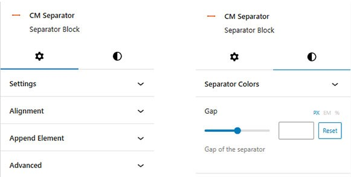
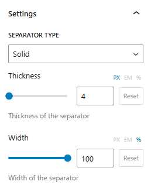
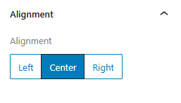
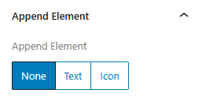
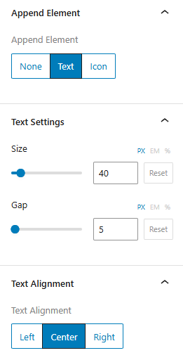
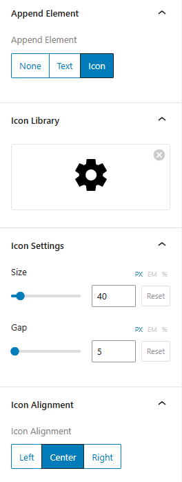
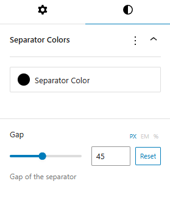

## Introduction
CM Separator is a versatile WordPress Blocks plugin designed to enhance your content layout by adding stylish and customizable separators between sections, elements, or blocks within the WordPress content editor. CM Separator provides a simple yet powerful way to visually divide content, improving readability and design aesthetics.

To use our blocks, use the <b>+</b> button and search for "CM Separator" to access the block. This will insert a default separator design into your content.

## Separator Setting and Styles

Separator options and customization is categorized into Setting and Styles.

### Separator Settings

#### Settings

The setting consist of Separator Type, Thickness and Width option.

###### Separator Type
The available options for separator types include classic styles like solid, double, dashed, and dotted, as well as more creative choices, such as shapes or icons.

###### Thickness
Sets the thickness of the separator

###### Width
Sets the width of the separator

#### Alignment

This options allow you to align the separator left, right or center.

#### Append Elements
This setting allows you to add elements such as text and icon to the separator.
By default is set to none.

###### Append Text

Choosing the text option enables text to be entered into the separator, along with settings for text and text alignment.

- The text settings allow for adjusting the text size and gap between text and separator. 
- Furthermore, the text alignment option controls whether the text appears at the start, center, or end of the separator.

###### Append Icon

Selecting the icon option enables the addition of an icon to the separator, along with the icon library, icon settings, and icon alignment options.

- The icon library allows for selecting the desired icon, with settings to adjust the icon size and gap between icon and separator.  
- Additionally, the alignment option determines whether the icon appears at the start, center, or end of the separator.

### Separator Styles

The Styles section includes options for color and gap adjustments for the separator.

- The separator color option applies color to the separator, as well as to the text (if text is added) and the icon (if an icon is included).
- The gap option lets you set top and bottom margins for the separator.