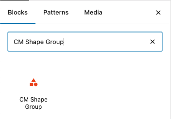
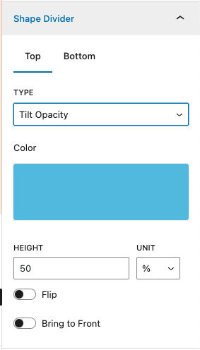
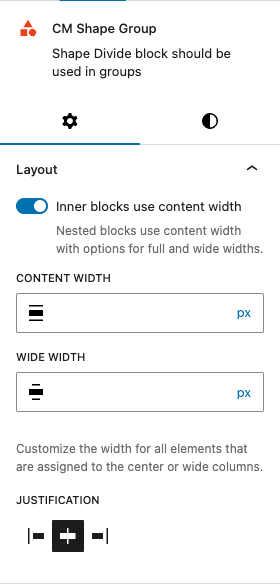

##Introduction

CM Shape Group is a versatile block that lets you add stylish shape designs to your group elements. Enhance your site's visual appeal by incorporating dynamic and creative shapes, making your layouts more engaging and visually striking.

###Inserting the Shape Group Block
To use the CM Shape Group block, click the + button and search for "CM Shape Group" to add it to your layout. Jumpstart your design with over five pre-built templates, or fully customize your shape group from scratch.

*Figure 1: How to insert shape group*

###Configuration & Settings

####Shape Divider:
Customize the appearance of your shape dividers with the following options:

- Position: Choose whether to display the shape divider at the Top or Bottom of the block.
- Type: Select from a variety of predefined shape styles.
- Color: Set the color of the shape divider to match your design.
- Height Adjustment: Control the height of the shape divider for better visual impact.
- Flip Option: Invert the shape design for alternate styling.
- Bring to Front: Move the content in front of the shape divider for a layered effect.

####Layout and Content Width

This is an advanced option that allows you to add custom content widths to the overall Group block for all blocks assigned to the center or wide columns. In many cases, you won’t need to use this option. When you toggle this option on, it allows the Group block to inherit the options set by your theme. When it’s toggled off, you can customize to your liking.

###Example
