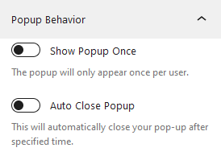
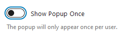
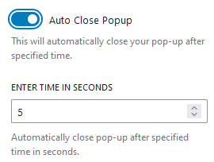

Popup Behaviour allows you to determine how the Popup should behave once it's shown. Sometimes, you want your popup to 
be shown only once or multiple time. Or you may want it to auto close after certain time. 

You can configure it as per your preference as outlined below.

## Show Popup Once

Enabling this option will only show popup once per user. After closing the popup ,it will not be shown to the user.
This would be helpful if you do not want to obstruct your user with multiple instances of same popup.
      
## Auto Close Popup

This allows you to auto close the popup after certain time. By default, enabling it will close the Popup after 5 seconds.
But you can change it to your liking by inputting the time in seconds.

    Note: This behaviour is available only to the **Time** and **Scroll** trigger .
      
    