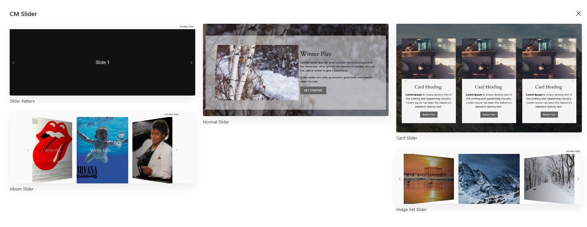

## Introduction
Cm Slider is a WordPress Blocks that is designed to make the creation of slider easier and flexible inside WordPress content editor. Using CM Slider you can easily add images and contents to any posts and pages. This WP Blocks offers various customization options like pagination options, Navigation customization, animation effects offering user to customize as per their wish.

## Slider Templates

To use Our blocks you can directly press <b>+</b> button and search for CM Slider block. You can either start building slider from scratch or choose out beautiful prebuild patterns. Currently there are 5 beautiful slider templates available, which you can use it or also can modify as well.