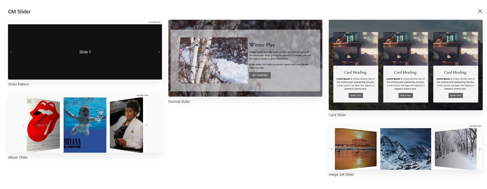
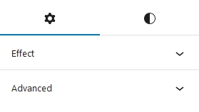
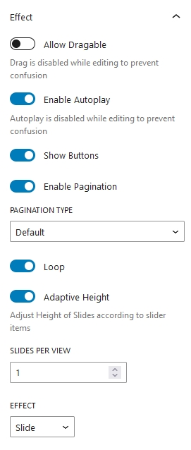
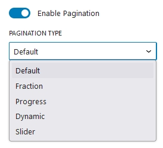
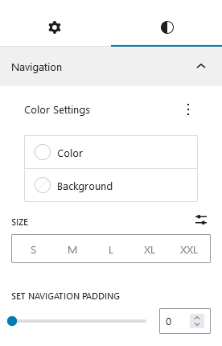

## Introduction
Cm Slider is a WordPress Blocks that is designed to make the creation of slider easier and flexible inside WordPress content editor. Using CM Slider you can easily add images and contents to any posts and pages. This WP Blocks offers various customization options like pagination options, Navigation customization, animation effects offering user to customize as per their wish.

## Slider Templates

To use Our blocks you can directly press <b>+</b> button and search for CM Slider block. You can either start building slider from scratch or choose out beautiful prebuild patterns. Currently there are 5 beautiful slider templates available, which you can use it or also can modify as well.
## Slider Setting and Styles
Slider options and customization  is categorized into Setting and Styles.

### Slider Setting

#### Allow Dragable
When you enable this option, your slider becomes draggable. If you drag while holding the slider, you will be able to navigate sliders while swiping. This option is effective for mobile users.

####  Enable Autoplay
Enabling this options automatically play the slider. You don't have to navigate between slides using navigation button or by sliding. 

#### Show Buttons
It allows you to show next and prev navigation button.

#### Enable Pagination

Turning on this option enables the pagination. You can also choose the pagination styles.

#### Loop
Enabling this options plays slider in a infinite loop.

#### Adaptive Height
By enabling this option adjust the height of the slider automatically  on the basis of the content used inside the slider.

#### Slider per view
We can adjust the total no of slider item you want  to show in a screen.

### Slider Styles

#### Color and Background
Navigation Color and Background can be choosed accordingly to your needs.

#### Size
This options adjust the size of navigation button.

#### Navigation Padding
Next and Prev Navigation button padding can be adjusted accordingly.