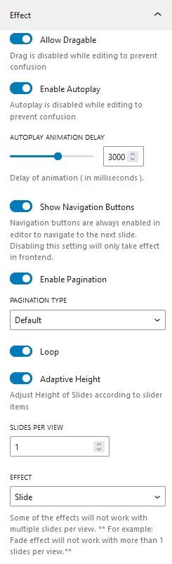
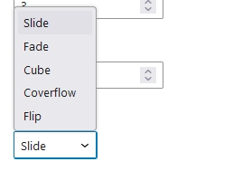
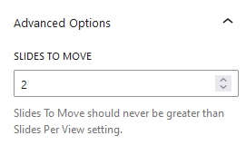
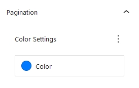

## Introduction
CM Slider is a WordPress Blocks designed to create slider easy and flexible in WordPress content editor. CM Slider can easily add images and contents to any posts and pages. It offers various customization options like pagination options, navigation customization, animation effects offering user to customize in a desired way.

## Slider Patterns

To use our blocks, use the <b>+</b> button and search for "CM Slider" to access the block. Jumpstart your design with a choice of over five  pre-built slider templates, or customize your slider entirely from scratch.
    
    Note!!
    
    Please do not wrap the CM Slider within a Row or Stack Block, as it 
    causes issues. Instead, use a Group for wrapping it if necessary. 

## Slider Setting

### Effect

All the effects related setting of our slider are here.

#### Allow Draggable
When you enable this option, your slider becomes draggable. If you drag while holding the slider, you will be able to navigate sliders while swiping. This option is effective for mobile users. Draggable is disabled in backend to prevent confusion to user.

####  Enable Autoplay
When this option is enabled, the slider plays automatically. It's not necessary to slide or use the navigation button to move between slides. Once autoplay is enabled, you can also set a timer delay for it. This option is also disabled on the backend to make editing less difficult.

#### Show Navigation Buttons
It allows you to show next and prev navigation button. This option just applies front-end effects to ease user navigation to the required slide on backend.

#### Enable Pagination

Turning on this option enables the pagination. You can also choose the pagination styles.

#### Loop
Enabling this options plays slider in a infinite loop.

#### Adaptive Height
By enabling this option adjust the height of the slider automatically  on the basis of the content used inside the slider.

#### Slider per view
We can change the total number of slider items that are displayed on the screen. An input field where you can change the spacing between sliders appears if you add more than one slider to a screen.

#### Space Between
This options only appears if the slider per view is more than 1. Here, you can add the gap(In px) between slider items.

#### Effects

Five different slider effects are available. Slide, Fade, Cube, Coverflow and Flip.

### Advanced Options

You can choose how many slider elements to move on a single slide with this option.

> ##### Infinite Loop
> Total number of slides should be at least double the amount of Slide Per View i.e If Slide Per View is 2, You must have at lest 4 slides.
> 
> ##### Slides Per Group
> This optins determines how many slides to move at a time. Slides Per Group should never exceed Slides Per View.

## Slider Styles

### Navigation 
Don't get confused if you didn't see navigation styles. This panel only appears if you enable **Show Navigation Buttons** from setting tab.

#### Color and Background
Navigation Color and Background can be choosed accordingly to your needs.

#### Size
This options adjust the size of navigation button.

#### Set Navigation Padding
Next and Prev Navigation button padding can be adjusted accordingly.

### Pagination 
This panel only appears if you trun on **Enable Pagination** from setting tab.

 The option allows you to choose the color of pagination.
