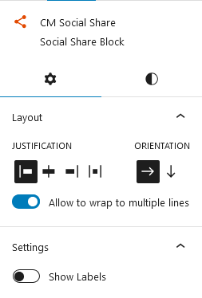
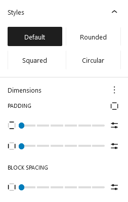
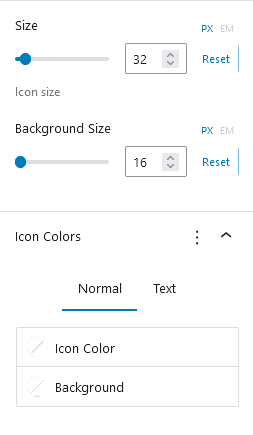

## Introduction
The CM Social Share plugin is a wordpress plugin for enhancing website's social media presence. With its collection of social media icons it can be customized in terms of size, color, and style to fit the content and expand website's social media presence.

## Use Social Share 
To use Our blocks, use the <b>+</b> button and search for "CM Social Share" to access the block.This will insert a default social icon list. You can then customize the icon list according to your preferences.

### Social Share Setting

#### Layout
The layout options let you align content left, center, right, or justify it. You can arrange items horizontally or vertically, and enable wrapping to allow content to flow onto multiple lines.

#### Settings
The setting option allows to display labels alongside the social media icons.

### Social Share Style

#### Styles
The icons can be styled to rounded, square, or circular background shapes.

#### Dimensions
The Dimensions feature allows you to adjust padding inside and block spacing of social media icons. 

#### Size 
The social icons size can be adjusted according to your preference.

#### Background Size 
The background size of icons can also be adjusted according to your preference.

#### Icon Colors
The icon feature modify the icon color, background color, and the text color of the associated labels.

