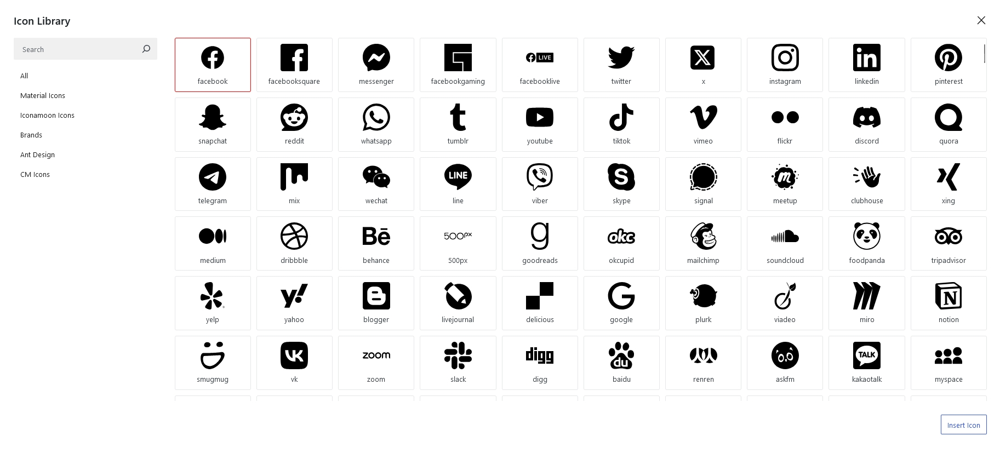
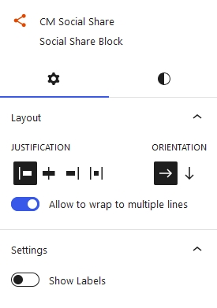
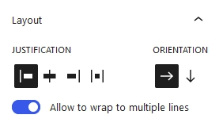
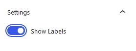
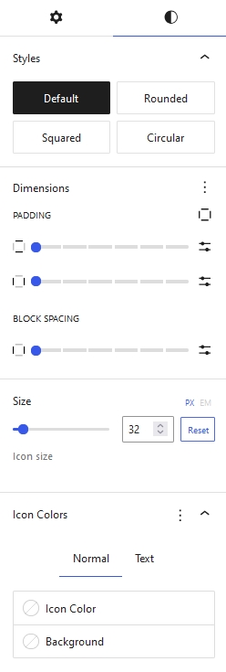
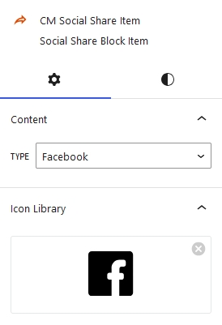
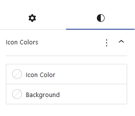

## Introduction
**CM Social Share** is a WordPress plugin designed to make social sharing easy and seamless within the WordPress content editor. With CM Social Share, users can quickly add social sharing buttons to posts, pages, and custom post types, enabling visitors to share content across various social media platforms. It offers a range of customization options, such as button styles, placement options, and share counts, allowing users to tailor the social sharing experience to match their site's design and functionality.

## Social Share Icons

CM Social Share simplifies social media sharing by offering over 1000+ customizable icons. It allows users to easily add social sharing buttons to posts, pages, and custom post types. With various design and placement options, it enhances user engagement and integrates seamlessly into any website's layout.

## Social Share Setting and Styles
Social Share options and customization  is categorized into Setting and Styles.

### Social Share Setting
Social Share Setting can be adjusted from here

#### Layout
From here, you can change the Social Share layout. You can change the justification, orientation and wrap the line s if social share exceeds the width limits.

#### Label
From here you can show and hide the icons label

### Social Share Styles

You have the option to select from four distinct icon styles: squared, rounded, round, or the default form.

#### Dimensions
You may adjust the padding and block spacing between the icons under Dimensions. Here, you can select the padding of each icon at once.

#### Size
Size defines the size of an icon. You can set icon size either in **px** or **em**

#### Icon Colors

There are two different tabs of icon colors. One is for the label of the icon, and the other is for its color. From the first tab, you can customize the color of the icon and its background. Similar options for text color are provided on the second tab.

### Social Share Item Setting

#### Content Type
Type of content can be selected here. Select the content from the options where you wish to share the content along with the content type. For example, YouTube, Facebook, etc.

#### Icon Library
Our icon library offers more than 1000+ customizable icons, providing diverse options to enhance your social sharing experience.

### Social Share Item Styles

You can customize each item's icon color and icon background color using the icon colors styles.