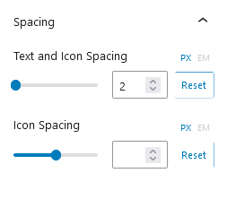

## Introduction
The CM Star Rating is a WordPress Block designed to implement customizable star ratings. It allows users to adjust the number of stars, change the star colors, and resize the rating icons. This block offers flexibility by letting users select from various star icon styles, making it easy to align the rating system with the website’s overall design. 

## Use Star Rating

To use Our blocks, use the <b>+</b> button and search for "CM Star Rating" to access the block.This will insert a default star rating into your content. 

### Star Rating Settings

#### Basics

##### Enable Title
It enables or disables a title for the star rating.

##### Star Position
It selects the position of the star rating (before or after the label).

##### Rating
It adjusts the star rating value.

##### Size
It adjusts the size of the star rating in pixels or ems.

#### Icon Library
An icon library is a collection of icons organized into categories, allowing users to browse, search, and select icons for use in websites, applications.

#### Alignment
The alignment feature lets users choose how content is positioned on a page. It provides three options: left, center, right and justify.

### Star Rating Style

#### Size
The size customization option allows you to select the font size of the star rating text from small, medium, large, extra large, or extra extra large. 

#### Colors
The color customization options allow you to select the color of the filled stars (marked color), the color of the empty stars (unmarked color), and the color of the text associated with the star rating.

#### Spacing 
The spacing customization options allow you to adjust the distance between the text and the icon, as well as the spacing between individual icons within the star rating element. 

