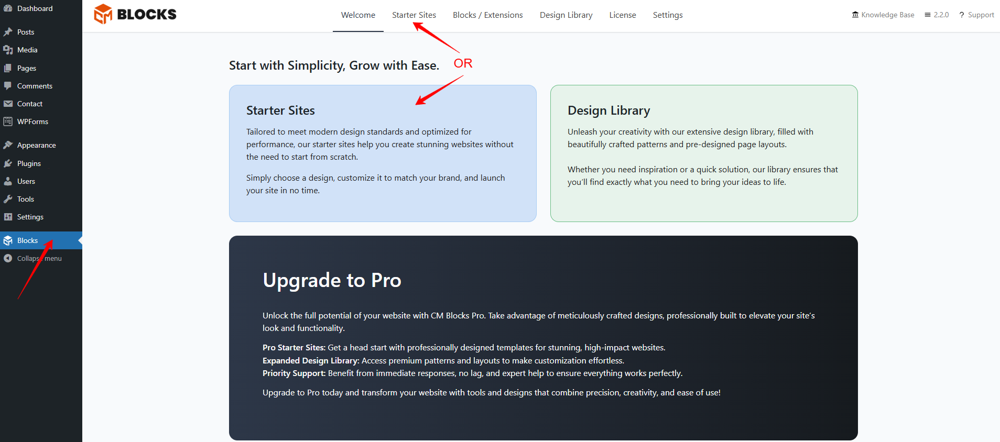
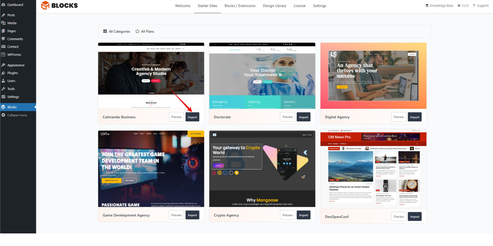

## Getting Started!

To import the starter sites please follow the following instruction

##### Step 1: Install and activate CM Blocks.
##### Step 2: Go to the Blocks section.
##### Step 3: Choose the Starter Sites option.
##### Step 4: Import the desired Starter Site from the available options based on your needs.

