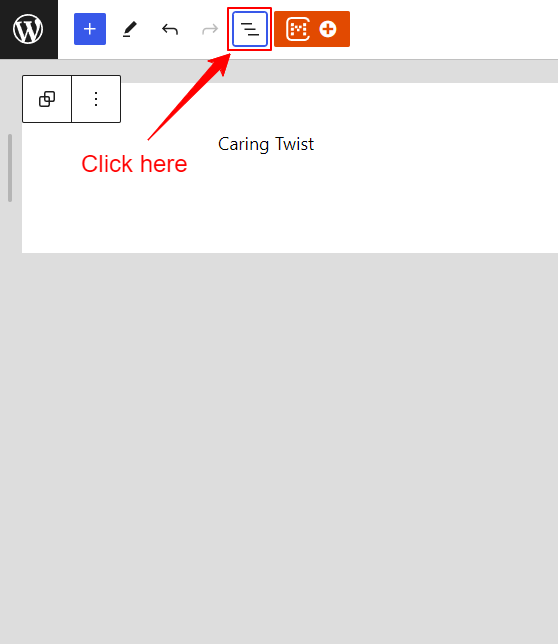
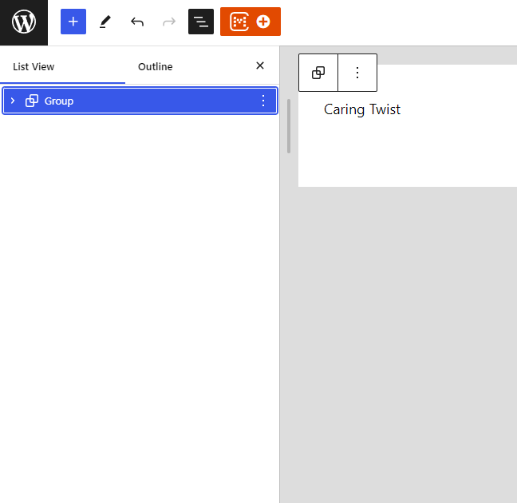
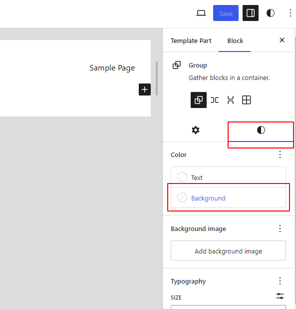

## What is a Sticky Header?

A sticky header is a fixed navigation bar that stays at the top of the screen as users scroll through the content. This
ensures that important navigation links and information are always accessible, enhancing user experience and website
usability.

## How to make your site header sticky?

1. Install and activate the CM Blocks plugin.
2. Navigate to Dashboard → Appearance → Editor.
   
3. Select the Patterns Tab 
4. Select the Header Tab and then select the template that you want to edit. For example: header is selected
   
6. In the CM Blocks Header Options, enable the "Enable Sticky Header" option.
   

## How to add background to a sticky transparent header template part?

1. Navigate to Dashboard → Appearance → Editor.
2. Select the Patterns Tab
3. Select the Header Tab and then select the template that you want to edit.
4. Click on the Document Overview at the top left to open the panel if it's not already open.
   
5. Select the group block within your content.
   
6. Go to the settings panel on the right, click on the Style tab, and then choose the Background option to set a background color.
   