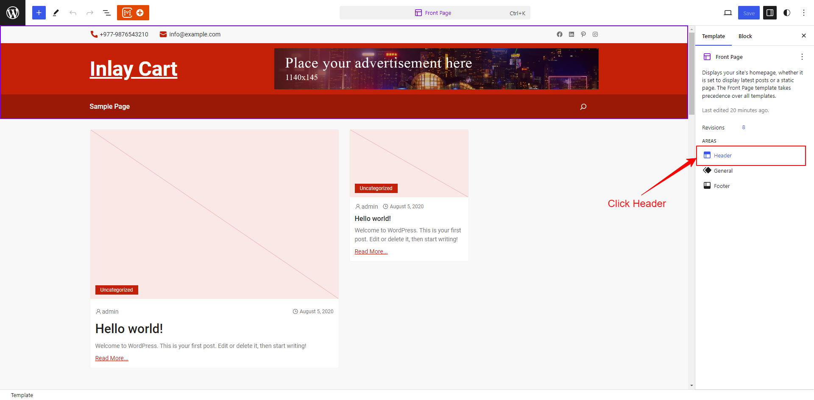

## What is a Sticky Header?

A sticky header is a fixed navigation bar that stays at the top of the screen as users scroll through the content. This ensures that important navigation links and information are always accessible, enhancing user experience and website usability.

## How to add sticky header to the template?

1. Install and activate the CM Blocks plugin.
2. Navigate to Dashboard →  Appearance →  Editor.
   
3. In the sidebar on the right, select the Header Tab.
   
4. In the CM Blocks Header Setting, enable the "Enable Sticky Header" option.
   
5. Click Save.

