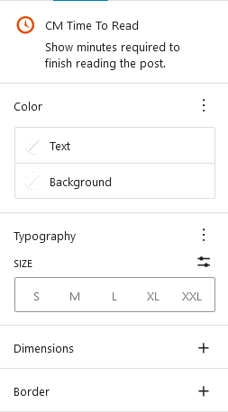

## Introduction
CM Time to Read is a Wordpress plugin that displays the estimated time required to finish reading a post.It helps users quickly gauge the length of an article and decide whether to read it.

## Use CM Time to Read
To use Our blocks, use the <b>+</b> button and search for "CM Time to read" to access the block.You can then customize it by selecting from the icon library according to your preferences.

### Time to Read Setting

#### Color
The color feature allows to select the color of the text and background elements. You can choose from a variety of colors to customize the appearance of your content.

#### Size
The size feature allows you to select the font size of the text.

#### Dimension
The dimensions feature allows you to adjust padding inside and margin outside.

#### Border
The border feature customizea the thickness, shape, and color of a border around the time.

