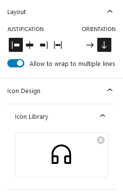
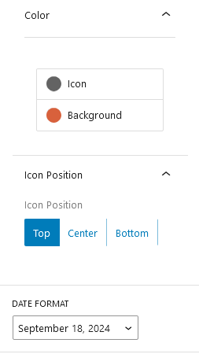
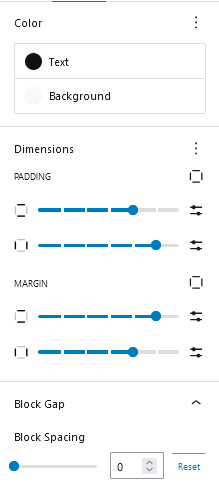

## Introduction
CM Timeline is a WordPress block designed to visually represent a series of events or milestones in chronological order.Users can easily adjust the spacing between events, change the color scheme, and customize the appearance of the timeline's markers. Additionally, each event point can include a date, title, and a brief description, allowing for detailed and informative presentations. 

## Use CM Timeline
To use Our blocks, use the <b>+</b> button and search for "CM Timeline" to access the block.This will insert a default timeline structure into your content. 

### Timeline Settings

#### Layout
The layout customization options allow you to adjust the alignment of the text within its container, the orientation of the text, and whether the text should wrap to multiple lines if necessary.

#### Icon Design
The icon design allows you to select an icon from a library, customize its color, and adjust its vertical position within a container.
    
#### Date Format 
Date format allows to choose different date formats to display dates in their desired style. 

### Timeline Style

#### Color
The color customization options allow you to choose whether to apply a custom color to the text and/or the background of the Timelime Item. 

#### Dimensions
The dimensions customization options allow you to adjust the padding and margin around the Timeline Item. 

#### Block Gap 
The block gap customization option allows you to adjust the spacing between timeline items.
